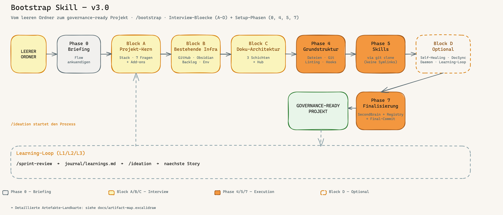

[🇬🇧 English](#english) · [🇩🇪 Deutsch](#deutsch)

---

<a name="english"></a>

# Code-Crash Framework — Claude Code Skills for Coding Governance

> A **battle-tested skill collection** for Claude Code — sets up a complete AI-driven development governance framework for any new project, through an interview-driven orchestrator plus a coherent set of sub-skills covering the full delivery cycle.

**Core idea:** AI writes your code. Governance makes sure you still understand why in six months.

---

## What Is This?

`code-crash-framework/` is a container of Claude Code skills that form one coherent development workflow:

- **The orchestrator** (`bootstrap/`) interviews you about a new project and scaffolds the full governance framework: runtime instructions, documentation SSoT, Developer Onboarding, backlog adapter, Git hooks, skill selection, optional learning-loop.
- **Sub-skills** (`ideation/`, `implement/`, etc.) cover the downstream delivery workflow — from idea to sprint review.
- **Specialist bundle skills** (`security-architect/`, `dpo/`) live **inside the framework repo** (vendored, since BOO-74) so a single `git clone` is self-contained. Bootstrap installs them from here.
- **Companion skills** (`../research/`, `../skill-creator/`, etc.) are referenced by the governance flow but maintained as stand-alone skills at `claudecodeskills/` top level.

Full setup guide: **[HANDBUCH.md](HANDBUCH.md)** (German, ~190 KB) + **[HANDBUCH.en.md](HANDBUCH.en.md)** (English, ~165 KB) — appendices A–S cover Hermes, sprint sizing, tool adapters, token efficiency (N), privacy (O), deployment scenarios (P), sovereignty stack (Q), multi-operator coordination (R) and skill-installation strategy (S).

**What's new (v0.2.0):** see **[docs/releases/v0.2.0-overview.md](docs/releases/v0.2.0-overview.md)** — privacy-by-design, deployment scenarios, sovereignty stack, multi-operator coordination, dpo + security-architect as bundle skills, vault-harvest engine.

**Tool-neutral specification:** [CONVENTIONS.md](CONVENTIONS.md) — describes the framework conventions without binding to a specific AI tool. Read this first when adopting the framework with Codex, Cursor, or any other tool (see HANDBUCH Appendix K).

**Project handover by design:** every bootstrap now chooses a project documentation SSoT: Obsidian Vault, repo `docs/project/`, external DMS, or an explicit repo fallback. It also creates or links a `Developer Onboarding` artifact so an unfamiliar team or another coding tool can take over the project without relying on old chat history.

---

## System Overview


*From empty folder to governance-ready project — four interview blocks (A–D) frame the decisions, four setup phases (0, 4, 5, 7) execute them. Block D spins up optional components only on demand.*

---

## The Skills

### Orchestrator + Sub-Skills (this folder)

| Skill | Command | What it does |
|-------|---------|-------------|
| **[bootstrap](bootstrap/)** | `/bootstrap` | **Start here.** Interview-driven project setup — CLAUDE.md, Linear, Git hooks, skill selection. |
| **[ideation](ideation/)** | `/ideation` | Idea → 4-perspective research → Linear issue with acceptance criteria. |
| **[backlog](backlog/)** | `/backlog` | Sprint planning — which story now, which later, and why. Dependency-aware. |
| **[implement](implement/)** | `/implement` | 8-step protocol: Agent pattern → Spec → Code → Governance validation → Commit. |
| **[architecture-review](architecture-review/)** | `/architecture-review` | Reviews architecture dimensions — risks, tech debt, improvement potential. |
| **[sprint-review](sprint-review/)** | `/sprint-review` | Quarterly audit: architecture health, tech debt, backlog hygiene, learning loop. |
| **[pitch](pitch/)** | `/pitch` | Closes the 4P pipeline — gathers evidence (metrics, architecture diff, intent fulfillment) as a Markdown cheat sheet. No slides, human runs the demo. |
| **[grafana](grafana/)** | `/grafana` | Grafana Cloud dashboards via MCP — panels, PromQL, alert rules. |
| **[cloud-system-engineer](cloud-system-engineer/)** | `/cloud-system-engineer` | VPS/Docker infrastructure: health checks, firewall, DNS, resources. |
| **[visualize](visualize/)** | `/visualize` | Generate architecture diagrams in Miro from existing documentation. |

### Specialist bundle skills (this folder, vendored — BOO-74)

| Skill | Command | What it does |
|-------|---------|-------------|
| **[security-architect](security-architect/)** | `/security-architect` | STRIDE threat modeling, OWASP Top 10, ASVS 5.0 — 4 modes (Design/Review/Audit/Skill-Scan). Installed by bootstrap when the security dimension is active. |
| **[dpo](dpo/)** | `/dpo` | Data Protection Officer — privacy by design (GDPR/BDSG/nDSG). 3 modes (Assess/Review/Audit). Installed by the bootstrap Privacy add-on (BOO-69). |

*Master of these two stays in `claudecodeskills/` (via `publish_skill.py`); the framework repo holds a vendored mirror so a single clone is self-contained.*

### Top-level companion skills (parent folder)

| Skill | Command | What it does |
|-------|---------|-------------|
| **[research](../research/)** | `/research` | 2-tier routing: Quick (WebSearch) or Deep (Perplexity + cross-check). |
| **[skill-creator](../skill-creator/)** | `/skill-creator` | Create, package and register new skills into the global registry. |
| **[design-md-generator](../design-md-generator/)** | `/design-md-generator` | Extract a website's visual design system into a machine-readable DESIGN.md. |
| **[setup-checklist](../setup-checklist/)** | `/setup-checklist` | Claude Code best-practice audit — global and project settings. |

---

## How the Skills Work Together

```
💡 Idea
  └─ /ideation ──→ Linear issue + ACs (4 perspectives, research-backed)
       └─ /backlog ──→ Prioritization: which story goes next?
            └─ /implement ──→ Spec file → Code → Governance validation → Commit
                 └─ /architecture-review ──→ Risks? Tech debt?
                      └─ /sprint-review ──→ Quarterly audit: what worked?
                           └─ /pitch ──→ Evidence briefing for the stakeholder demo
```

Governance gates run automatically on `git commit` / `git push` (and `git pull`):
- `spec-gate.sh` — blocks commits without a linked spec file
- `doc-version-sync.sh` — blocks pushes when documentation is out of sync
- `sensitive-paths` gate (BOO-18) — stops at security-sensitive paths until `review-ok`
- `personal-data-paths` gate (BOO-69) — stops at personal-data paths until `privacy-ok`
- `post-merge` vault-harvest hook (BOO-77, opt-in) — mirrors selected docs into a personal vault after `git pull`

No spec, no commit. That's the difference between a prompt and a governance framework.

> **Operating at scale:** running on a VPS, a team, or in a regulated industry? HANDBUCH appendices **P** (deployment scenarios), **R** (multi-operator coordination, 5–20+ operators), **S** (where do skills/tools/hooks belong) and **Q** (EU-sovereignty stack) cover the setup decisions; appendix **O** documents privacy-by-design.

---

## Where to Start

| Situation | Recommendation |
|-----------|---------------|
| New project, empty folder | → [/bootstrap](bootstrap/) — start here |
| Existing project, needs structure | → [HANDBUCH.md §4](HANDBUCH.md) — step-by-step retrofit |
| Just one specific skill | → Clone the skill folder and install it |
| Want to understand everything first | → [HANDBUCH.md](HANDBUCH.md) — full reference |
| Concrete operational question | → [docs/qa.md](docs/qa.md) — living Q&A |

---

## Prerequisites

- **Claude Code** (CLI or IDE extension)
- **Backlog system** — Linear (recommended) / Microsoft 365 Planner / GitHub Issues / none
- **GitHub** repository for your project
- **Project documentation SSoT** — Obsidian Vault, repo `docs/project/`, external DMS, or temporary repo fallback
- Optional extensions: Grafana Cloud, Miro, Hostinger VPS — skills use what's available

---


<a name="deutsch"></a>

# Code-Crash Framework — Claude Code Skills fuer Coding Governance

> Eine **battle-tested Skill-Sammlung** für Claude Code — setzt ein vollständiges KI-getriebenes Governance-Framework für jedes neue Projekt auf, über einen interview-geführten Orchestrator plus kohärente Sub-Skills die den kompletten Delivery-Zyklus abdecken.

**Kernidee:** KI schreibt deinen Code. Governance stellt sicher, dass du in 6 Monaten noch weißt warum.

---

## Was ist das hier?

`code-crash-framework/` ist ein Container von Claude Code Skills, die zusammen einen kohärenten Entwicklungs-Workflow bilden:

- **Der Orchestrator** (`bootstrap/`) führt das Interview zu einem neuen Projekt und legt das komplette Governance-Framework an: Runtime-Anweisungen, Dokumentations-SSoT, Developer Onboarding, Backlog-Adapter, Git-Hooks, Skill-Auswahl, optionaler Learning-Loop.
- **Sub-Skills** (`ideation/`, `implement/`, etc.) decken den nachgelagerten Delivery-Workflow ab — von der Idee bis zum Sprint-Review.
- **Spezialisten-Bundle-Skills** (`security-architect/`, `dpo/`) liegen **im Framework-Repo selbst** (vendored, seit BOO-74) — ein einziges `git clone` ist self-contained. Bootstrap installiert sie von hier.
- **Companion-Skills** (`../research/`, `../skill-creator/`, etc.) werden vom Governance-Flow referenziert, aber als eigenständige Skills auf Top-Level von `claudecodeskills/` gepflegt.

Komplettes Setup-Handbuch: **[HANDBUCH.md](HANDBUCH.md)** (Deutsch, ~190 KB) + **[HANDBUCH.en.md](HANDBUCH.en.md)** (Englisch, ~165 KB) — Anhaenge A–S decken Hermes, Sprint-Sizing, Tool-Adapter, Token-Effizienz (N), Privacy (O), Deployment-Szenarien (P), Souveraenitaets-Stack (Q), Multi-Operator-Koordination (R) und Skill-Installations-Strategie (S) ab.

**Was ist neu (v0.2.0):** siehe **[docs/releases/v0.2.0-overview.md](docs/releases/v0.2.0-overview.md)** — Privacy-by-Design, Deployment-Szenarien, Souveraenitaets-Stack, Multi-Operator-Koordination, dpo + security-architect als Bundle-Skills, Vault-Harvest-Engine.

**Tool-neutrale Spezifikation:** [CONVENTIONS.md](CONVENTIONS.md) — beschreibt die Framework-Konventionen ohne Bindung an ein bestimmtes KI-Tool. Lies das zuerst, wenn du das Framework mit Codex, Cursor oder einem anderen Tool aufnimmst (siehe HANDBUCH Anhang K).

**Uebergabe standardmaessig mitgedacht:** Jeder Bootstrap waehlt jetzt eine Projekt-Dokumentations-SSoT: Obsidian Vault, Repo `docs/project/`, externes DMS oder expliziter Repo-Fallback. Zusaetzlich wird ein `Developer Onboarding` erzeugt oder verlinkt, damit ein fremdes Team oder ein anderes Coding-Tool das Projekt ohne alte Chat-Historie uebernehmen kann.

---

## Das System im Überblick



*Vom leeren Ordner zum governance-ready Projekt — vier Interview-Blöcke (A–D) umrahmen die Entscheidungen, vier Setup-Phasen (0, 4, 5, 7) setzen sie um. Block D aktiviert optionale Komponenten nur auf Wunsch.*

---

## Die Skills

### Orchestrator + Sub-Skills (dieser Ordner)

| Skill | Befehl | Was er tut |
|-------|--------|------------|
| **[bootstrap](bootstrap/)** | `/bootstrap` | **Einstieg:** Interview-geführtes Projekt-Setup — CLAUDE.md, Linear, Git-Hooks, Skill-Auswahl. |
| **[ideation](ideation/)** | `/ideation` | Idee → 4-Perspektiven-Research → Linear Issue mit ACs. |
| **[backlog](backlog/)** | `/backlog` | Sprint Planning — welche Story jetzt, welche nach hinten, warum. Abhängigkeiten-aware. |
| **[implement](implement/)** | `/implement` | 8-Schritte-Protokoll: Agent-Pattern → Spec → Code → Governance-Validation → Commit. |
| **[architecture-review](architecture-review/)** | `/architecture-review` | Prüft Architektur-Dimensionen — Risiken, Tech Debt, Verbesserungspotential. |
| **[sprint-review](sprint-review/)** | `/sprint-review` | Quartals-Audit: Architektur-Gesundheit, Tech Debt, Backlog-Hygiene, Learning-Loop. |
| **[pitch](pitch/)** | `/pitch` | Schliesst die 4P-Pipeline — sammelt Evidenz (Metriken, Architektur-Diff, Intent-Erfuellung) als Markdown-Spickzettel. Keine Slides, Mensch macht die Demo. |
| **[grafana](grafana/)** | `/grafana` | Grafana Cloud Dashboards via MCP — Panels, PromQL, Alert Rules. |
| **[cloud-system-engineer](cloud-system-engineer/)** | `/cloud-system-engineer` | VPS/Docker-Infrastruktur: Health-Check, Firewall, DNS, Ressourcen. |
| **[visualize](visualize/)** | `/visualize` | Architektur-Diagramme in Miro aus bestehenden Doku-Dateien generieren. |

### Spezialisten-Bundle-Skills (dieser Ordner, vendored — BOO-74)

| Skill | Befehl | Was er tut |
|-------|--------|------------|
| **[security-architect](security-architect/)** | `/security-architect` | STRIDE Threat Modeling, OWASP Top 10, ASVS 5.0 — 4 Modi (Design/Review/Audit/Skill-Scan). Wird vom Bootstrap installiert, wenn die Security-Dimension aktiv ist. |
| **[dpo](dpo/)** | `/dpo` | Data Protection Officer — Datenschutz by Design (DSGVO/BDSG/nDSG). 3 Modi (Assess/Review/Audit). Wird vom Privacy-Add-on des Bootstrap installiert (BOO-69). |

*Master dieser zwei bleibt in `claudecodeskills/` (via `publish_skill.py`); das Framework-Repo haelt einen vendored Mirror, damit ein einziges Clone self-contained ist.*

### Top-Level Companion-Skills (Elternordner)

| Skill | Befehl | Was er tut |
|-------|--------|------------|
| **[research](../research/)** | `/research` | 2-Tier-Routing: Quick (WebSearch) oder Deep (Perplexity + Gegencheck). |
| **[skill-creator](../skill-creator/)** | `/skill-creator` | Neue Skills erstellen, paketieren und in die globale Registry einbinden. |
| **[design-md-generator](../design-md-generator/)** | `/design-md-generator` | Visuelles Design-System einer Website als maschinenlesbare DESIGN.md extrahieren. |
| **[setup-checklist](../setup-checklist/)** | `/setup-checklist` | Claude Code Best-Practice-Audit — globale und projekt-Settings. |

---

## Wie die Skills zusammenspielen

```
💡 Idee
  └─ /ideation ──→ Linear Issue + ACs (4 Perspektiven, Research-backed)
       └─ /backlog ──→ Priorisierung: welche Story jetzt?
            └─ /implement ──→ Spec-File → Code → Governance-Validation → Commit
                 └─ /architecture-review ──→ Risiken? Tech Debt?
                      └─ /sprint-review ──→ Quartals-Audit: Was hat funktioniert?
                           └─ /pitch ──→ Evidenz-Briefing fuer den Stakeholder-Demo
```

Governance-Gates laufen automatisch bei `git commit` / `git push` (und `git pull`):
- `spec-gate.sh` — blockiert Commits ohne verknüpftes Spec-File
- `doc-version-sync.sh` — blockiert Pushes wenn Doku veraltet ist
- `sensitive-paths`-Gate (BOO-18) — stoppt bei security-sensitiven Pfaden bis `review-ok`
- `personal-data-paths`-Gate (BOO-69) — stoppt bei personenbezogenen Pfaden bis `privacy-ok`
- `post-merge`-Vault-Harvest-Hook (BOO-77, opt-in) — spiegelt ausgewaehlte Docs nach `git pull` in einen persoenlichen Vault

Kein Spec, kein Commit. Das ist der Unterschied zwischen einem Prompt und einem Governance-Framework.

> **Im Team / auf VPS / reguliert?** HANDBUCH-Anhaenge **P** (Deployment-Szenarien), **R** (Multi-Operator-Koordination, 5–20+ Operatoren), **S** (wo gehoeren Skills/Tools/Hooks hin) und **Q** (EU-Souveraenitaets-Stack) decken die Setup-Entscheidungen ab; Anhang **O** dokumentiert Privacy-by-Design.

---

## Wo anfangen?

| Situation | Empfehlung |
|-----------|------------|
| Neues Projekt, leerer Ordner | → [/bootstrap](bootstrap/) |
| Bestehendes Projekt, Chaos | → [HANDBUCH.md §4](HANDBUCH.md) |
| Nur einzelne Skills | → Gewünschten Skill-Ordner klonen und installieren |
| Alles verstehen bevor ich anfange | → [HANDBUCH.md](HANDBUCH.md) |
| Konkrete Praxisfrage | → [docs/qa.md](docs/qa.md) — lebendes Q&A |

---

## Voraussetzungen

- **Claude Code** (CLI oder IDE-Extension)
- **Backlog-System** — Linear (empfohlen) / Microsoft 365 Planner / GitHub Issues / keines
- **GitHub** Repository für dein Projekt
- **Projekt-Dokumentations-SSoT** — Obsidian Vault, Repo `docs/project/`, externes DMS oder temporaerer Repo-Fallback
- Optional: Grafana Cloud, Miro, Hostinger VPS — Skills nutzen was verfügbar ist

---
