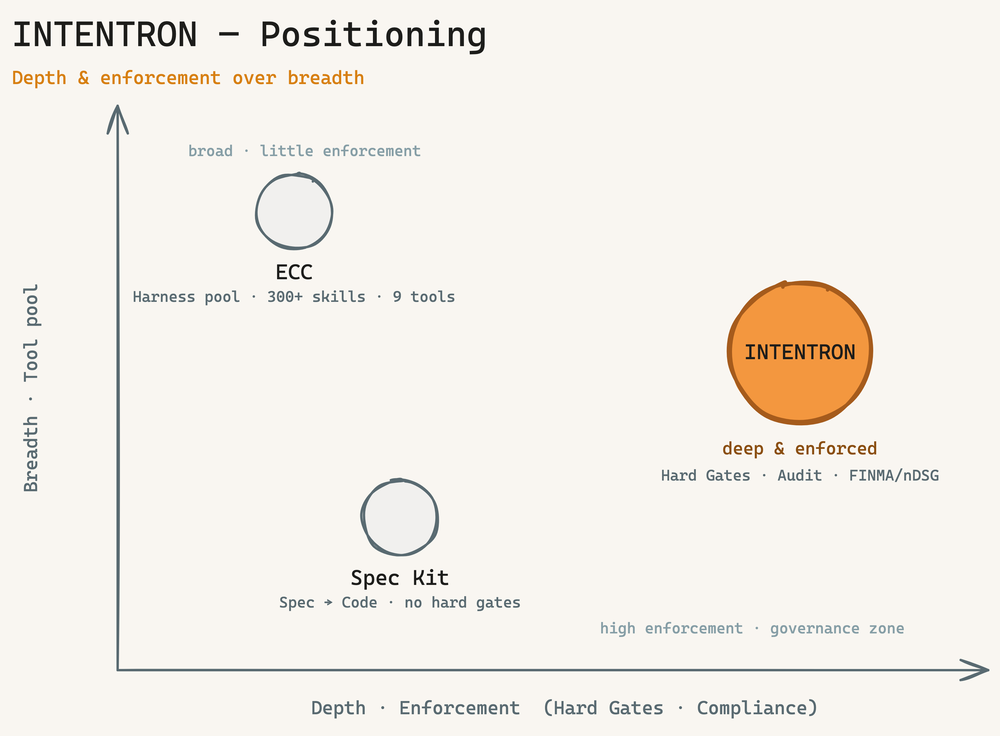
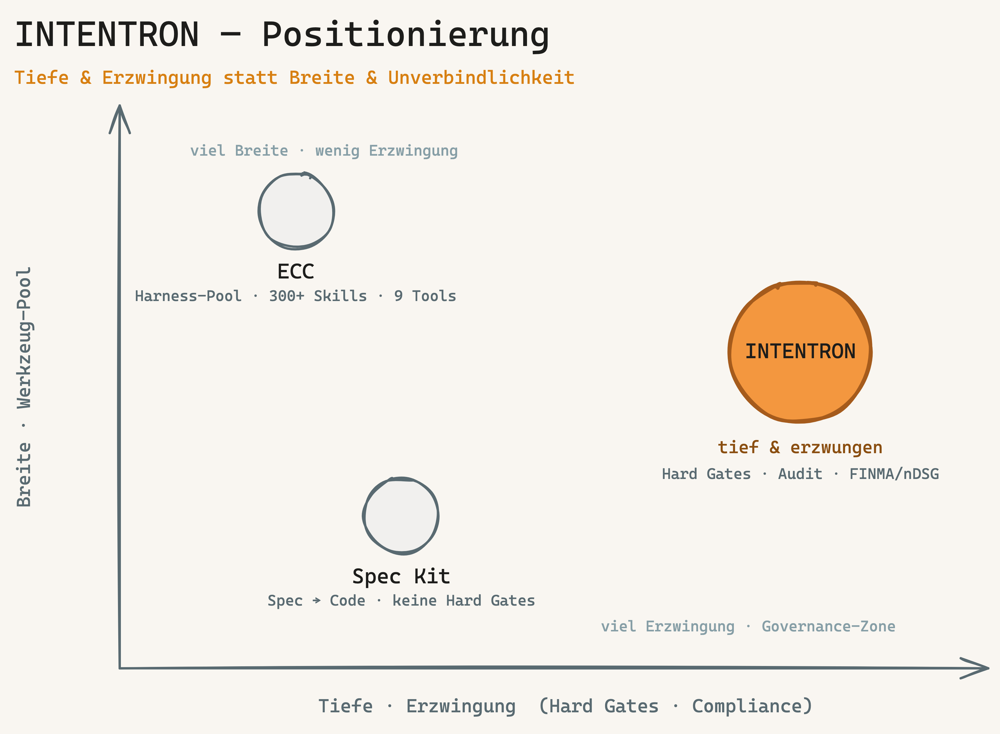

[🇬🇧 English](#english) · [🇩🇪 Deutsch](#deutsch)

---

<a name="english"></a>

# INTENTRON — AI-Driven Development Governance
### by OWLIST

> A **battle-tested skill collection** for Claude Code — sets up a complete AI-driven development governance framework for any new project, through an interview-driven orchestrator plus a coherent set of sub-skills covering the full delivery cycle.

**Core idea:** AI writes your code. Governance makes sure you still understand why in six months.

INTENTRON turns the method described in Matthias Schrader's book "Code Crash" into a working operating system for AI-assisted development.

---

## Why INTENTRON? The edge

Most spec-driven frameworks (Spec Kit & co.) optimize exactly one thing: turning a specification into code. Quality, governance, security, privacy, team-readiness — they leave those out. INTENTRON flips the focus: the generated code is not the product, the *path from intent to production* is — with guardrails a team would otherwise have to build itself.

Four things set us apart concretely:

1. **One contract — tool-neutral and machine-executable.** Your rules (tests, logging, security thresholds, governance) live in *one* place and are shared by three readers: the human, the AI tool (Claude, Codex, Cursor) and the CI that enforces them. Others have rules as prose that nobody enforces — and lock you into *one* tool.
2. **Intent before implementation.** We start one step earlier than the spec — at the *why* (after Schrader). That stops the AI from cleanly building the wrong thing.
3. **Governance that scales with you.** Solo gets three gates, an enterprise gets twelve — same record, only the strictness is dialed up or down.
4. **Privacy & security in the bundle.** DPO and security-architect reviews are built in, not an afterthought. For regulated industries that's the entry ticket.

**Common denominator:** Others optimize "the AI writes code." We optimize "a team — human plus *any* AI — gets intent to production, with guardrails it didn't have to build itself." The guardrails are invisible until they catch something — and when they catch, they explain why.

---

## How INTENTRON differs

A methodical comparison against the closest spec-driven framework:

| | INTENTRON | Spec Kit |
|---|---|---|
| Focus | Path from intent → production, with gates | Specification → code |
| Hard gates (blocking) | ✅ Spec, Sensitive-Paths, Coverage, Slopsquatting | ❌ none |
| Intent before spec | ✅ | ❌ |
| Governance scales (Solo→Enterprise) | ✅ | ❌ |
| Privacy/Security built in | ✅ (DPO + Security-Architect) | ❌ |
| Tool-neutral (1 contract) | ✅ AGENTS.md + CONVENTIONS | partial |

**A different category, not a competitor:** ECC (Everything Claude Code) and similar collections are *harness optimizers / tool pools* — breadth across many tools. INTENTRON is a *method with enforced discipline* — depth. Different axes: breadth does not replace gates.



*Two different axes: harness optimizers buy you breadth across tools; INTENTRON buys you depth — enforced discipline from intent to production.*

---

## What Is This?

`intentron/` is a container of Claude Code skills that form one coherent development workflow:

- **The orchestrator** (`bootstrap/`) interviews you about a new project and scaffolds the full governance framework: runtime instructions, documentation SSoT, Developer Onboarding, backlog adapter, Git hooks, skill selection, optional learning-loop.
- **Sub-skills** (`ideation/`, `implement/`, etc.) cover the downstream delivery workflow — from idea to sprint review.
- **Specialist bundle skills** (`security-architect/`, `dpo/`) live **inside the framework repo** (vendored, since BOO-74) so a single `git clone` is self-contained. Bootstrap installs them from here.
- **Companion skills** (`../research/`, `../skill-creator/`, etc.) are referenced by the governance flow but maintained as stand-alone skills at `claudecodeskills/` top level.

Full setup guide: **[HANDBUCH.md](HANDBUCH.md)** (German, ~230 KB) + **[HANDBUCH.en.md](HANDBUCH.en.md)** (English, ~200 KB) — appendices A–U cover Hermes, sprint sizing, Codex onboarding (J), tool adapters (K), token efficiency (N), privacy (O), deployment scenarios (P), sovereignty stack (Q), multi-operator coordination (R), skill-installation strategy (S), post-install verification (T) and multi-project operation (U).

**What's new (v0.2.0):** see **[docs/releases/v0.2.0-overview.md](docs/releases/v0.2.0-overview.md)** — privacy-by-design, deployment scenarios, sovereignty stack, multi-operator coordination, dpo + security-architect as bundle skills, vault-harvest engine, post-install verification, multi-project operation, optional container profile.

**Tool-neutral specification:** [CONVENTIONS.md](CONVENTIONS.md) — describes the framework conventions without binding to a specific AI tool. Read this first when adopting the framework with Codex, Cursor, or any other tool (see HANDBUCH Appendix K).

**Project handover by design:** every bootstrap now chooses a project documentation SSoT: Obsidian Vault, repo `docs/project/`, external DMS, or an explicit repo fallback. It also creates or links a `Developer Onboarding` artifact so an unfamiliar team or another coding tool can take over the project without relying on old chat history.

---

## Why the method comes from "Code Crash" (and how to read this)

The thinking behind INTENTRON comes from **Matthias Schrader's book "Code Crash"**. Schrader's thesis, in one line: AI now writes the code, so the scarce resource is no longer typing speed — it is **intent, governance and the ability to still understand a system months later**. INTENTRON is our attempt to turn that thesis into a working *operating system* for AI-assisted development: skills, gates and artifacts that keep the "why" alive while the AI handles the "how".

- **You do not need to have read the book.** The framework and HANDBUCH are written to stand on their own — every concept is explained where it is used.
- **But we recommend it** for the deeper context. The HANDBUCH references Schrader throughout (anti-patterns, production-readiness, the 4P pipeline), and **Appendix M ("Schrader Decoder")** maps the book's chapters onto the concrete framework pieces.
- If you only read one thing first: this README, then [HANDBUCH.en.md](HANDBUCH.en.md) §1–§8.

## Not a one-size-fits-all framework

INTENTRON gives you a **solid base structure** — but every company, team and setup is different, and we deliberately **do not try to model every case** in the framework itself. The framework stays lightweight; the **HANDBUCH appendices provide guidance for different circumstances** so you can adapt it to your reality:

| Your situation | Where the guidance is |
|----------------|-----------------------|
| Solo vs. VPS vs. team-server | Appendix P (deployment scenarios) |
| Team of 5–20+ developers | Appendix R (multi-operator coordination) |
| Where do skills/tools/hooks live | Appendix S (installation strategy) |
| Several projects on one machine | Appendix U (multi-project operation) |
| EU / regulated industry | Appendix Q (sovereignty stack) + Appendix O (privacy) |
| "Did my setup actually work?" | Appendix T (post-install verification) |
| Running under Codex / another AI tool | Appendix J (Codex onboarding) + Appendix K (tool adapters) |

The framework is the skeleton. **You tailor the muscles** — the appendices tell you how, and a real consumer fork (e.g. a GitHub-Issues + personal-vault setup) shows it works in practice.

---

## System Overview


*From empty folder to governance-ready project — four interview blocks (A–D) frame the decisions, four setup phases (0, 4, 5, 7) execute them. Block D spins up optional components only on demand.*

---

## The Skills

### Orchestrator + Sub-Skills (this folder)

| Skill | Command | What it does |
|-------|---------|-------------|
| **[bootstrap](bootstrap/)** | `/bootstrap` | **Start here.** Interview-driven project setup — CLAUDE.md, Linear, Git hooks, skill selection. |
| **[ideation](ideation/)** | `/ideation` | Idea → 4-perspective research → Linear issue with acceptance criteria. |
| **[backlog](backlog/)** | `/backlog` | Sprint planning — which story now, which later, and why. Dependency-aware. |
| **[implement](implement/)** | `/implement` | 8-step protocol: Agent pattern → Spec → Code → Governance validation → Commit. |
| **[architecture-review](architecture-review/)** | `/architecture-review` | Reviews architecture dimensions — risks, tech debt, improvement potential. |
| **[sprint-review](sprint-review/)** | `/sprint-review` | Quarterly audit: architecture health, tech debt, backlog hygiene, learning loop. |
| **[pitch](pitch/)** | `/pitch` | Closes the 4P pipeline — gathers evidence (metrics, architecture diff, intent fulfillment) as a Markdown cheat sheet. No slides, human runs the demo. |
| **[grafana](grafana/)** | `/grafana` | Grafana Cloud dashboards via MCP — panels, PromQL, alert rules. |
| **[cloud-system-engineer](cloud-system-engineer/)** | `/cloud-system-engineer` | VPS/Docker infrastructure: health checks, firewall, DNS, resources. |
| **[visualize](visualize/)** | `/visualize` | Generate architecture diagrams in Miro from existing documentation. |

### Specialist bundle skills (this folder, vendored — BOO-74)

| Skill | Command | What it does |
|-------|---------|-------------|
| **[security-architect](security-architect/)** | `/security-architect` | STRIDE threat modeling, OWASP Top 10, ASVS 5.0 — 4 modes (Design/Review/Audit/Skill-Scan). Installed by bootstrap when the security dimension is active. |
| **[dpo](dpo/)** | `/dpo` | Data Protection Officer — privacy by design (GDPR/BDSG/nDSG). 3 modes (Assess/Review/Audit). Installed by the bootstrap Privacy add-on (BOO-69). |

*Master of these two stays in `claudecodeskills/` (via `publish_skill.py`); the framework repo holds a vendored mirror so a single clone is self-contained.*

### Top-level companion skills (parent folder)

| Skill | Command | What it does |
|-------|---------|-------------|
| **[research](../research/)** | `/research` | 2-tier routing: Quick (WebSearch) or Deep (Perplexity + cross-check). |
| **[skill-creator](../skill-creator/)** | `/skill-creator` | Create, package and register new skills into the global registry. |
| **[design-md-generator](../design-md-generator/)** | `/design-md-generator` | Extract a website's visual design system into a machine-readable DESIGN.md. |
| **[setup-checklist](../setup-checklist/)** | `/setup-checklist` | Claude Code best-practice audit — global and project settings. |

---

## How the Skills Work Together

```
💡 Idea
  └─ /ideation ──→ Linear issue + ACs (4 perspectives, research-backed)
       └─ /backlog ──→ Prioritization: which story goes next?
            └─ /implement ──→ Spec file → Code → Governance validation → Commit
                 └─ /architecture-review ──→ Risks? Tech debt?
                      └─ /sprint-review ──→ Quarterly audit: what worked?
                           └─ /pitch ──→ Evidence briefing for the stakeholder demo
```

Governance gates run automatically on `git commit` / `git push` (and `git pull`):
- `spec-gate.sh` — blocks commits without a linked spec file
- `doc-version-sync.sh` — blocks pushes when documentation is out of sync
- `sensitive-paths` gate (BOO-18) — stops at security-sensitive paths until `review-ok`
- `personal-data-paths` gate (BOO-69) — stops at personal-data paths until `privacy-ok`
- `post-merge` vault-harvest hook (BOO-77, opt-in) — mirrors selected docs into a personal vault after `git pull`

No spec, no commit. That's the difference between a prompt and a governance framework.

> **Operating at scale:** running on a VPS, a team, or in a regulated industry? HANDBUCH appendices **P** (deployment scenarios), **R** (multi-operator coordination, 5–20+ operators), **S** (where do skills/tools/hooks belong) and **Q** (EU-sovereignty stack) cover the setup decisions; appendix **O** documents privacy-by-design.

---

## Where to Start

| Situation | Recommendation |
|-----------|---------------|
| New project, empty folder | → [/bootstrap](bootstrap/) — start here |
| Existing project, needs structure | → [HANDBUCH.md §4](HANDBUCH.md) — step-by-step retrofit |
| Just one specific skill | → Clone the skill folder and install it |
| Want to understand everything first | → [HANDBUCH.md](HANDBUCH.md) — full reference |
| Concrete operational question | → [docs/qa.md](docs/qa.md) — living Q&A |

---

## Prerequisites

- **Claude Code** (CLI or IDE extension)
- **Backlog system** — Linear (recommended) / Microsoft 365 Planner / GitHub Issues / none
- **GitHub** repository for your project
- **Project documentation SSoT** — Obsidian Vault, repo `docs/project/`, external DMS, or temporary repo fallback
- Optional extensions: Grafana Cloud, Miro, Hostinger VPS — skills use what's available

---

## License

This project is **source-available** under the [PolyForm Perimeter License 1.0.0](LICENSE.md). Use, modification, and internal deployment — including commercial use — are permitted. You may **not** provide a product that competes with this software (no reselling as a competing product). **INTENTRON** and **OWLIST** are trademarks of OWLIST GmbH; this license grants no trademark rights.

---

<sub>"INTENTRON" is an independent product of OWLIST GmbH and has no business relationship with Matthias Schrader or the publisher of the book "Code Crash". The methodology is based on the principles described in the book "Code Crash"; "Code Crash" is the title of that book. All names mentioned are trademarks of their respective owners.</sub>

---


<a name="deutsch"></a>

# INTENTRON — Governance für KI-gestützte Entwicklung
### by OWLIST

> Eine **battle-tested Skill-Sammlung** für Claude Code — setzt ein vollständiges KI-getriebenes Governance-Framework für jedes neue Projekt auf, über einen interview-geführten Orchestrator plus kohärente Sub-Skills die den kompletten Delivery-Zyklus abdecken.

**Kernidee:** KI schreibt deinen Code. Governance stellt sicher, dass du in 6 Monaten noch weißt warum.

INTENTRON setzt die im Buch »Code Crash« von Matthias Schrader beschriebene Methode in ein funktionierendes Betriebssystem für KI-gestützte Entwicklung um.

---

## Warum INTENTRON? Der Vorteil

Die meisten Spec-Driven-Frameworks (Spec Kit & Co.) optimieren genau eine Sache: aus einer Spezifikation Code generieren. Qualität, Governance, Sicherheit, Datenschutz, Teamfähigkeit blenden sie aus. INTENTRON dreht den Fokus: Nicht der generierte Code ist das Produkt, sondern der *Weg von der Absicht zur Produktion* — mit Leitplanken, die ein Team sonst selbst bauen müsste.

Vier Dinge unterscheiden uns konkret:

1. **Ein Vertrag — tool-neutral und maschinen-ausführbar.** Eure Regeln (Tests, Logging, Security-Schwellen, Governance) leben an *einer* Stelle und werden von drei Lesern geteilt: dem Menschen, dem KI-Tool (Claude, Codex, Cursor) und der CI, die sie erzwingt. Andere haben Regeln als Prosa, die niemand durchsetzt — und binden dich an *ein* Tool.
2. **Intent vor Implementation.** Wir starten eine Stufe früher als die Spec — beim *Warum* (nach Schrader). Das verhindert, dass die KI sauber das Falsche baut.
3. **Governance, die mitwächst.** Solo bekommt drei Gates, ein Konzern zwölf — dieselbe Platte, nur die Strenge wird gedimmt.
4. **Privacy & Security im Bündel.** DPO- und Security-Architect-Prüfungen sind eingebaut, kein Nachgedanke. Für regulierte Branchen ist das die Eintrittskarte.

**Gemeinsamer Nenner:** Andere optimieren „die KI schreibt Code". Wir optimieren „ein Team — Mensch plus *beliebige* KI — bringt Intent nach Produktion, mit Leitplanken, die es nicht selbst bauen musste." Die Leitplanken sind unsichtbar, bis sie etwas fangen — und wenn sie fangen, erklären sie warum.

---

## Wie sich INTENTRON unterscheidet

Ein methodischer Vergleich mit dem nächstliegenden Spec-Driven-Framework:

| | INTENTRON | Spec Kit |
|---|---|---|
| Fokus | Weg von Intent → Produktion, mit Gates | Spezifikation → Code |
| Hard Gates (blockierend) | ✅ Spec, Sensitive-Paths, Coverage, Slopsquatting | ❌ keine |
| Intent vor Spec | ✅ | ❌ |
| Governance skaliert (Solo→Konzern) | ✅ | ❌ |
| Privacy/Security eingebaut | ✅ (DPO + Security-Architect) | ❌ |
| Tool-neutral (1 Vertrag) | ✅ AGENTS.md + CONVENTIONS | teilweise |

**Eine andere Kategorie, kein Wettbewerber:** ECC (Everything Claude Code) und ähnliche Sammlungen sind *Harness-Optimierer / Werkzeug-Pools* (Breite über viele Tools). INTENTRON ist eine *Methode mit erzwungener Disziplin* (Tiefe). Verschiedene Achsen — Breite ersetzt keine Gates.



*Zwei verschiedene Achsen: Harness-Optimierer geben dir Breite über Tools; INTENTRON gibt dir Tiefe — erzwungene Disziplin von Intent bis Produktion.*

---

## Was ist das hier?

`intentron/` ist ein Container von Claude Code Skills, die zusammen einen kohärenten Entwicklungs-Workflow bilden:

- **Der Orchestrator** (`bootstrap/`) führt das Interview zu einem neuen Projekt und legt das komplette Governance-Framework an: Runtime-Anweisungen, Dokumentations-SSoT, Developer Onboarding, Backlog-Adapter, Git-Hooks, Skill-Auswahl, optionaler Learning-Loop.
- **Sub-Skills** (`ideation/`, `implement/`, etc.) decken den nachgelagerten Delivery-Workflow ab — von der Idee bis zum Sprint-Review.
- **Spezialisten-Bundle-Skills** (`security-architect/`, `dpo/`) liegen **im Framework-Repo selbst** (vendored, seit BOO-74) — ein einziges `git clone` ist self-contained. Bootstrap installiert sie von hier.
- **Companion-Skills** (`../research/`, `../skill-creator/`, etc.) werden vom Governance-Flow referenziert, aber als eigenständige Skills auf Top-Level von `claudecodeskills/` gepflegt.

Komplettes Setup-Handbuch: **[HANDBUCH.md](HANDBUCH.md)** (Deutsch, ~230 KB) + **[HANDBUCH.en.md](HANDBUCH.en.md)** (Englisch, ~200 KB) — Anhaenge A–U decken Hermes, Sprint-Sizing, Codex-Onboarding (J), Tool-Adapter (K), Token-Effizienz (N), Privacy (O), Deployment-Szenarien (P), Souveraenitaets-Stack (Q), Multi-Operator-Koordination (R), Skill-Installations-Strategie (S), Post-Install-Verifikation (T) und Multi-Projekt-Betrieb (U) ab.

**Was ist neu (v0.2.0):** siehe **[docs/releases/v0.2.0-overview.md](docs/releases/v0.2.0-overview.md)** — Privacy-by-Design, Deployment-Szenarien, Souveraenitaets-Stack, Multi-Operator-Koordination, dpo + security-architect als Bundle-Skills, Vault-Harvest-Engine, Post-Install-Verifikation, Multi-Projekt-Betrieb, optionales Container-Profil.

**Tool-neutrale Spezifikation:** [CONVENTIONS.md](CONVENTIONS.md) — beschreibt die Framework-Konventionen ohne Bindung an ein bestimmtes KI-Tool. Lies das zuerst, wenn du das Framework mit Codex, Cursor oder einem anderen Tool aufnimmst (siehe HANDBUCH Anhang K).

**Uebergabe standardmaessig mitgedacht:** Jeder Bootstrap waehlt jetzt eine Projekt-Dokumentations-SSoT: Obsidian Vault, Repo `docs/project/`, externes DMS oder expliziter Repo-Fallback. Zusaetzlich wird ein `Developer Onboarding` erzeugt oder verlinkt, damit ein fremdes Team oder ein anderes Coding-Tool das Projekt ohne alte Chat-Historie uebernehmen kann.

---

## Warum die Methode aus »Code Crash« kommt (und wie man das hier liest)

Der Denkanstoss hinter INTENTRON kommt aus **Matthias Schraders Buch »Code Crash«**. Schraders These in einem Satz: Die KI schreibt jetzt den Code — die knappe Ressource ist nicht mehr Tippgeschwindigkeit, sondern **Intent, Governance und die Faehigkeit, ein System auch in Monaten noch zu verstehen**. INTENTRON ist unser Versuch, diese These in ein funktionierendes *Betriebssystem* fuer KI-gestuetzte Entwicklung zu giessen: Skills, Gates und Artefakte, die das "Warum" am Leben halten, waehrend die KI das "Wie" uebernimmt.

- **Du musst das Buch nicht gelesen haben.** Framework und HANDBUCH stehen fuer sich — jedes Konzept wird dort erklaert, wo es genutzt wird.
- **Wir empfehlen es aber** fuer den tieferen Kontext. Das HANDBUCH nimmt durchgehend Bezug auf Schrader (Anti-Patterns, Production-Readiness, 4P-Pipeline), und **Anhang M ("Schrader-Decoder")** mappt die Buch-Kapitel auf die konkreten Framework-Bausteine.
- Wenn du zuerst nur eines liest: diese README, dann [HANDBUCH.md](HANDBUCH.md) §1–§8.

## Kein One-Size-Fits-All-Framework

INTENTRON gibt dir eine **solide Grundstruktur** — aber jedes Unternehmen, Team und Setup ist anders, und wir versuchen bewusst **nicht, jeden Einzelfall** im Framework selbst abzubilden. Das Framework bleibt leichtgewichtig; die **HANDBUCH-Anhaenge geben Guidance fuer unterschiedliche Gegebenheiten**, damit du es an deine Realitaet anpasst:

| Deine Situation | Wo die Guidance steht |
|-----------------|------------------------|
| Solo vs. VPS vs. Team-Server | Anhang P (Deployment-Szenarien) |
| Team mit 5–20+ Entwicklern | Anhang R (Multi-Operator-Koordination) |
| Wo gehoeren Skills/Tools/Hooks hin | Anhang S (Installations-Strategie) |
| Mehrere Projekte auf einer Maschine | Anhang U (Multi-Projekt-Betrieb) |
| EU / regulierte Branche | Anhang Q (Souveraenitaets-Stack) + Anhang O (Privacy) |
| "Hat mein Setup wirklich funktioniert?" | Anhang T (Post-Install-Verifikation) |
| Betrieb unter Codex / anderem KI-Tool | Anhang J (Codex-Onboarding) + Anhang K (Tool-Adapter) |

Das Framework ist das Skelett. **Die Muskeln schneiderst du** — die Anhaenge zeigen wie, und ein echter Consumer-Fork (z.B. ein GitHub-Issues- + persoenlicher-Vault-Setup) zeigt, dass es in der Praxis traegt.

---

## Das System im Überblick


*Vom leeren Ordner zum governance-ready Projekt — vier Interview-Blöcke (A–D) umrahmen die Entscheidungen, vier Setup-Phasen (0, 4, 5, 7) setzen sie um. Block D aktiviert optionale Komponenten nur auf Wunsch.*

---

## Die Skills

### Orchestrator + Sub-Skills (dieser Ordner)

| Skill | Befehl | Was er tut |
|-------|--------|------------|
| **[bootstrap](bootstrap/)** | `/bootstrap` | **Einstieg:** Interview-geführtes Projekt-Setup — CLAUDE.md, Linear, Git-Hooks, Skill-Auswahl. |
| **[ideation](ideation/)** | `/ideation` | Idee → 4-Perspektiven-Research → Linear Issue mit ACs. |
| **[backlog](backlog/)** | `/backlog` | Sprint Planning — welche Story jetzt, welche nach hinten, warum. Abhängigkeiten-aware. |
| **[implement](implement/)** | `/implement` | 8-Schritte-Protokoll: Agent-Pattern → Spec → Code → Governance-Validation → Commit. |
| **[architecture-review](architecture-review/)** | `/architecture-review` | Prüft Architektur-Dimensionen — Risiken, Tech Debt, Verbesserungspotential. |
| **[sprint-review](sprint-review/)** | `/sprint-review` | Quartals-Audit: Architektur-Gesundheit, Tech Debt, Backlog-Hygiene, Learning-Loop. |
| **[pitch](pitch/)** | `/pitch` | Schliesst die 4P-Pipeline — sammelt Evidenz (Metriken, Architektur-Diff, Intent-Erfuellung) als Markdown-Spickzettel. Keine Slides, Mensch macht die Demo. |
| **[grafana](grafana/)** | `/grafana` | Grafana Cloud Dashboards via MCP — Panels, PromQL, Alert Rules. |
| **[cloud-system-engineer](cloud-system-engineer/)** | `/cloud-system-engineer` | VPS/Docker-Infrastruktur: Health-Check, Firewall, DNS, Ressourcen. |
| **[visualize](visualize/)** | `/visualize` | Architektur-Diagramme in Miro aus bestehenden Doku-Dateien generieren. |

### Spezialisten-Bundle-Skills (dieser Ordner, vendored — BOO-74)

| Skill | Befehl | Was er tut |
|-------|--------|------------|
| **[security-architect](security-architect/)** | `/security-architect` | STRIDE Threat Modeling, OWASP Top 10, ASVS 5.0 — 4 Modi (Design/Review/Audit/Skill-Scan). Wird vom Bootstrap installiert, wenn die Security-Dimension aktiv ist. |
| **[dpo](dpo/)** | `/dpo` | Data Protection Officer — Datenschutz by Design (DSGVO/BDSG/nDSG). 3 Modi (Assess/Review/Audit). Wird vom Privacy-Add-on des Bootstrap installiert (BOO-69). |

*Master dieser zwei bleibt in `claudecodeskills/` (via `publish_skill.py`); das Framework-Repo haelt einen vendored Mirror, damit ein einziges Clone self-contained ist.*

### Top-Level Companion-Skills (Elternordner)

| Skill | Befehl | Was er tut |
|-------|--------|------------|
| **[research](../research/)** | `/research` | 2-Tier-Routing: Quick (WebSearch) oder Deep (Perplexity + Gegencheck). |
| **[skill-creator](../skill-creator/)** | `/skill-creator` | Neue Skills erstellen, paketieren und in die globale Registry einbinden. |
| **[design-md-generator](../design-md-generator/)** | `/design-md-generator` | Visuelles Design-System einer Website als maschinenlesbare DESIGN.md extrahieren. |
| **[setup-checklist](../setup-checklist/)** | `/setup-checklist` | Claude Code Best-Practice-Audit — globale und projekt-Settings. |

---

## Wie die Skills zusammenspielen

```
💡 Idee
  └─ /ideation ──→ Linear Issue + ACs (4 Perspektiven, Research-backed)
       └─ /backlog ──→ Priorisierung: welche Story jetzt?
            └─ /implement ──→ Spec-File → Code → Governance-Validation → Commit
                 └─ /architecture-review ──→ Risiken? Tech Debt?
                      └─ /sprint-review ──→ Quartals-Audit: Was hat funktioniert?
                           └─ /pitch ──→ Evidenz-Briefing fuer den Stakeholder-Demo
```

Governance-Gates laufen automatisch bei `git commit` / `git push` (und `git pull`):
- `spec-gate.sh` — blockiert Commits ohne verknüpftes Spec-File
- `doc-version-sync.sh` — blockiert Pushes wenn Doku veraltet ist
- `sensitive-paths`-Gate (BOO-18) — stoppt bei security-sensitiven Pfaden bis `review-ok`
- `personal-data-paths`-Gate (BOO-69) — stoppt bei personenbezogenen Pfaden bis `privacy-ok`
- `post-merge`-Vault-Harvest-Hook (BOO-77, opt-in) — spiegelt ausgewaehlte Docs nach `git pull` in einen persoenlichen Vault

Kein Spec, kein Commit. Das ist der Unterschied zwischen einem Prompt und einem Governance-Framework.

> **Im Team / auf VPS / reguliert?** HANDBUCH-Anhaenge **P** (Deployment-Szenarien), **R** (Multi-Operator-Koordination, 5–20+ Operatoren), **S** (wo gehoeren Skills/Tools/Hooks hin) und **Q** (EU-Souveraenitaets-Stack) decken die Setup-Entscheidungen ab; Anhang **O** dokumentiert Privacy-by-Design.

---

## Wo anfangen?

| Situation | Empfehlung |
|-----------|------------|
| Neues Projekt, leerer Ordner | → [/bootstrap](bootstrap/) |
| Bestehendes Projekt, Chaos | → [HANDBUCH.md §4](HANDBUCH.md) |
| Nur einzelne Skills | → Gewünschten Skill-Ordner klonen und installieren |
| Alles verstehen bevor ich anfange | → [HANDBUCH.md](HANDBUCH.md) |
| Konkrete Praxisfrage | → [docs/qa.md](docs/qa.md) — lebendes Q&A |

---

## Voraussetzungen

- **Claude Code** (CLI oder IDE-Extension)
- **Backlog-System** — Linear (empfohlen) / Microsoft 365 Planner / GitHub Issues / keines
- **GitHub** Repository für dein Projekt
- **Projekt-Dokumentations-SSoT** — Obsidian Vault, Repo `docs/project/`, externes DMS oder temporaerer Repo-Fallback
- Optional: Grafana Cloud, Miro, Hostinger VPS — Skills nutzen was verfügbar ist

---

## Lizenz

Dieses Projekt ist **source-available** unter der [PolyForm Perimeter License 1.0.0](LICENSE.md). Nutzung, Anpassung und interner Einsatz — auch kommerziell — sind erlaubt. Nicht erlaubt ist die Bereitstellung eines Produkts, das mit dieser Software **konkurriert** (kein Weiterverkauf als Konkurrenzprodukt). **INTENTRON** und **OWLIST** sind Marken der OWLIST GmbH; die Lizenz gewährt keine Markenrechte.

---

<sub>»INTENTRON« ist ein eigenständiges Produkt der OWLIST GmbH und steht in keiner geschäftlichen Verbindung zu Matthias Schrader oder dem Verlag des Buchs »Code Crash«. Die Methodik ist angelehnt an die im Buch »Code Crash« beschriebenen Prinzipien; »Code Crash« ist der Werktitel dieses Buchs. Alle genannten Namen sind Kennzeichen ihrer jeweiligen Inhaber.</sub>
