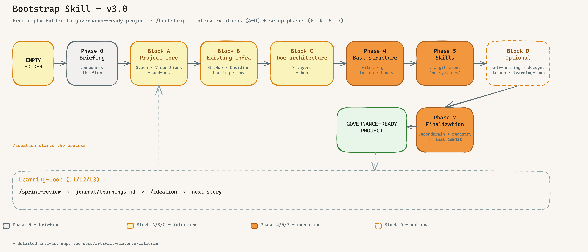

<a name="english"></a>

# Bootstrap Skill

> A **portable Claude Code skill** that sets up a complete AI-driven development governance framework for any new project — in 4 interview blocks (A-D) plus 7 setup phases, with zero external dependencies.

**Version 3.0 (April 2026)** — generic, interview-friendly, with portable learning loop (L1/L2/L3). No project-type lock-in, no trading-specific residue.
**Foundation:** Claude Code Best Practice Checklist v10 (OWLIST GmbH, 2026) — context engineering, global settings, context protection, and agent patterns are integrated into the bootstrap process.

---

## Big Picture



*Four interview blocks (A–D) frame the decisions, four setup phases (0, 4, 5, 7) execute them. Block D activates optional components only on demand. A dedicated Learning-Loop cycle (`/sprint-review` → `journal/learnings.md` → `/ideation`) makes the framework smarter with every sprint. [Excalidraw source](docs/bootstrap-big-picture.en.excalidraw)*

**Also available:** [Artifact Map](docs/artifact-map.en.excalidraw) — visual map of every artifact bootstrap creates (governance files, hooks, specs, self-healing, skills) and how they interact.

---

## Why This Framework?

Most AI development frameworks are either too much automation (black box, no traceability) or too little structure (cursor rules without governance). This one hits the sweet spot:

| Strength | What it means |
|----------|---------------|
| 🔒 **Governance enforced via Git hooks** | `spec-gate.sh` blocks every commit without a spec file. `doc-version-sync.sh` blocks every push on version drift. No other AI framework enforces this at the machine level. |
| 🔗 **Complete traceability** | Every change follows the path: Idea → Linear Issue → Spec → Commit → Changelog. Fully traceable — even months later. |
| 🔄 **Self-healing as safety net** | A cron agent checks every 15 minutes: Versions in sync? Files present? Daemons running? Auto-corrects when possible — no human intervention. |
| 👤 **Human-in-the-loop strictly enforced** | No code change without operator approval. No issue without spec. No spec without architecture dimensions. Claude asks — you decide. |

> **Comparison:** CrewAI has role-based crews. AutoGen has debate patterns. This framework has **enforced governance** — the only framework that machine-level guarantees AI-generated code meets the same quality standards as human code.

---

## What the Skill Does

When you type `/bootstrap` in Claude Code, it walks you through setting up:

| What | Why |
|------|-----|
| **GOVERNANCE.md** | Blueprint for the AI-driven development lifecycle — rules, workflows, quality gates |
| **CLAUDE.md** | Identity and rules file for Claude as AI operator |
| **Self-Healing Agent** | Watches document versions + daemon health every 15 min (cron) |
| **Doc-sync module** | Keeps all docs on the same version, optionally mirrored to Obsidian |
| **Issue writing guidelines** | Structured story format for AI + human collaboration |
| **Skills installation** | Wires up ideation, implement, backlog, architecture-review, and more |
| **Linear + GitHub + Obsidian** | Connects your toolchain into one coherent lifecycle |

---

## Industry-Standard 7-Stage SDLC

This framework mirrors proven development practices from Google, Amazon, and Meta, covering their **7-stage Software Development Lifecycle** fully with AI-supported skills.

| # | Phase | Google/Amazon standard | Our equivalent | Skills | Status |
|---|-------|------------------------|----------------|--------|--------|
| 1 | **Requirements** | PRD, user stories | `/ideation` → Linear issue | `/ideation` | ✅ |
| 2 | **Design** | Design doc, arch review, ADRs | `/ideation` (8 dims) + `/architecture-review` | `/ideation`, `/architecture-review` | ✅ |
| 3 | **Planning** | Task breakdown, sprint planning | `/implement` step 4 → `specs/ISSUE-XX.md` + `/backlog` | `/implement`, `/backlog` | ✅ |
| 4 | **Build** | Code, tests, CI | `/implement` steps 5–6 | `/implement` | ✅ |
| 5 | **Review** | Code review, QA, security | `/implement` step 7 post-validation | `/implement` | ✅ |
| 6 | **Deploy** | CI/CD, staging, rollout | Git push → handoff | — | ⚠️ Partial |
| 7 | **Monitor** | Observability, alerting | Self-Healing (15 min cron), `/status`, `/breakfix` | `/breakfix`, `/status` | ✅ |

---

## Core Flow

```
Idea → /ideation → Linear Issue → /backlog → /implement → Code + Docs → Git Push → Done
```

Every change is:
1. **Authorized** via a Linear issue (no code without ticket)
2. **Documented** in the same commit (no code without doc update)
3. **Monitored** by the self-healing agent (version drift detected within 15 min)
4. **Reproducible** — every workflow is a skill

---

## Installation

### On an existing Claude Code system
```bash
cp -r bootstrap/ ~/.claude/skills/bootstrap/
# Then in Claude Code: /bootstrap
```

### On a fresh machine (portable mode)
```bash
mkdir -p ~/.claude/skills/
cp -r bootstrap/ ~/.claude/skills/bootstrap/
claude
# /bootstrap
```

Zero external dependencies. All templates are embedded in `references/`.

---

## Bootstrap Phases (v3.0)

The bootstrap is structured as **4 interview blocks (A-D)** followed by **execution phases (4-7)**.

| Phase | What happens | Input needed? |
|-------|--------------|---------------|
| **Phase 0** — Briefing | Skill announces the 4-block flow | Confirmation "ready" |
| **Block A** — Project core | Stack + name + prefix + version + add-ons (Privacy, Cost, Signal, Compliance) | 7 questions |
| **Block B** — Existing infrastructure | GitHub/Obsidian/Backlog/Env — integrates into existing state | 5 questions |
| **Block C** — Doc architecture | 3-layer proposal (Story-Specs, Component-Docs, Architecture-Guidelines) + Hub-auto-linking | Confirmation / customization |
| **Phase 4** — Base structure | Directories, Git, core files, `.claudeignore`, hooks, component skeletons | `.env` confirmation |
| **Phase 5** — Skills via git-clone | Skills copied from `claudecodeskills` repo (no VPS symlinks) | Skill tier |
| **Block D** — Optional components | Self-Healing / DocSync / Automation-Daemon / Learning-Loop (L1/L2/L3) — all at the end | 4 yes/no + loop level |
| **Phase 7** — Registry + finalization | Obsidian PMO hub + project index + final commit | None |

---

## What Gets Created

After `/bootstrap`, your project and global environment have:

### Global (one-time, for all projects)
```
~/.claude/
├── settings.json          ← autoMemoryEnabled + Agent Teams + Permissions
└── CLAUDE.md              ← Model routing, agent strategy, secrets policy
```

### In the project
```
my-project/
├── lib/config.js · doc-sync.js         ← Single source of truth
├── agents/self-healing.js              ← Cron health monitor (15 min)
├── CLAUDE.md · CLAUDE.local.md         ← Project identity + personal overrides
├── ARCHITECTURE_DESIGN.md              ← Architectural decisions entry point
├── SYSTEM_ARCHITECTURE.md              ← Components, data flow, dependencies
├── COMPONENT_INVENTORY.md              ← File inventory (self-healing checks this)
├── GOVERNANCE.md · DEVELOPMENT_PROCESS.md · SECURITY.md
├── CHANGELOG.md · API_INVENTORY.md · INDEX.md · PROCESS_CATALOG.md
├── .env · .env.example · .gitignore · .claudeignore
├── specs/TEMPLATE.md                   ← Story template
├── journal/STRATEGY_LOG.md · LEARNINGS.md
└── .claude/
    ├── settings.json                   ← Hooks (spec-gate, guard, format, Stop)
    ├── ISSUE_WRITING_GUIDELINES.md
    ├── hooks/spec-gate.sh · doc-version-sync.sh · guard.sh · format.sh
    ├── rules/agent-patterns.md
    └── skills/                         ← Linked based on selected skill tier
```

For the full map of artifacts and how they interconnect, see the [Artifact Map](docs/artifact-map.en.excalidraw) (PNG: [docs/artifact-map.en.png](docs/artifact-map.en.png)).

---

## The 8 Inviolable Rules

Claude follows these rules across the entire framework:

1. **Never implement without a Linear issue** — every change must be traceable
2. **Never close an issue without a changelog** — history must be complete
3. **Never change code without asking first** — human-in-the-loop for risk control
4. **Never claim "done" without git push** — code must always be on remote
5. **Never shorten an operator briefing in Linear** — original text is truth
6. **Never create an issue without labels** — labels are essential for filtering
7. **Never move sub-tasks directly to Done** — always through "In Progress" first
8. **Never add an API integration without updating the API inventory**

---

## Interfaces with Other Skills

The bootstrap skill is the **source** for every other skill in the repo. It installs, wires, and configures them all.

| Downstream skill | What bootstrap sets up for it |
|------------------|------------------------------|
| `/ideation` | `ARCHITECTURE_DESIGN.md` scaffold, 8-dimension references, story templates |
| `/backlog` | Linear integration, issue-writing guidelines, dependency fields |
| `/implement` | Spec templates, governance hooks, 8-step protocol wiring |
| `/architecture-review` | Dimensions reference, document structure |
| `/sprint-review` | Template for quarterly audit |
| `/research` | `OPENROUTER_API_KEY` slot in `.env`, skill references |
| `/security-architect` | Security-by-design section, STRIDE/OWASP references |
| `/grafana` | Grafana MCP slot, PromQL conventions |
| `/cloud-system-engineer` | Hostinger MCP slot, infra-dimension reference |
| `/visualize` | Miro MCP slot, required doc structure |
| `/skill-creator` | Global registry entry |
| `/design-md-generator` | Output folder wiring |

Every skill in this repo starts from the foundation bootstrap lays.

---

## Self-Healing Mechanism

```
Cron (every 15 min)
  └── node agents/self-healing.js
      ├── Check M: All DOC_FILES on same VERSION as config.js?
      │   → No: alert + auto-sync via doc-sync.js
      ├── Check U: All documented components on disk?
      │   → No: warning
      └── Check P: All daemon processes running (lock files)?
          → No: restart via start-script with backoff
```

The version number in `config.js` is the **single source of truth**. Bump it → self-healing updates all doc files on the next cron run.

---

## Portability

Zero external dependencies:

| Needed | Source |
|--------|--------|
| GOVERNANCE.md content | `references/governance-template.md` (embedded) |
| Self-healing script | `references/self-healing-template.js` (embedded) |
| Doc-sync script | `references/doc-sync-template.js` (embedded) |
| Issue guidelines | `references/issue-writing-guidelines-template.md` (embedded) |
| File templates | `references/file-templates.md` (embedded) |

Copy the `bootstrap/` folder anywhere → it works immediately.

---

## Prerequisites

### Required
| What | Why |
|------|-----|
| **Claude Code** | The AI operator |
| **Node.js** | Self-healing + doc-sync |
| **GitHub repository** | Already created (empty or with code) |
| **SSH access to GitHub** | For `git push` without password |
| **Linear** account | Issue tracking (free tier works) |

### Optional
Obsidian, Telegram Bot Token, OpenRouter API Key, Hostinger API Key, Miro Access Token, Grafana Cloud, Prometheus.

---

## License

MIT — free to use, adapt for your project.

Part of the **Code-Crash Framework**.
Skills repo: [github.com/vibercoder79/claudecodeskills](https://github.com/vibercoder79/claudecodeskills)

---

---

