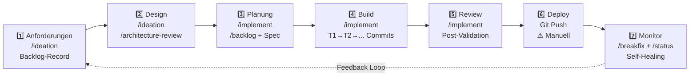
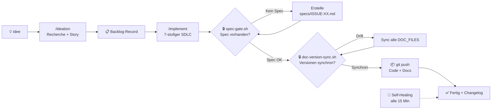
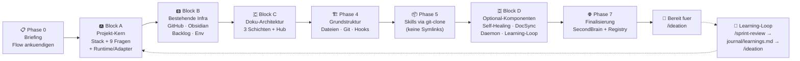
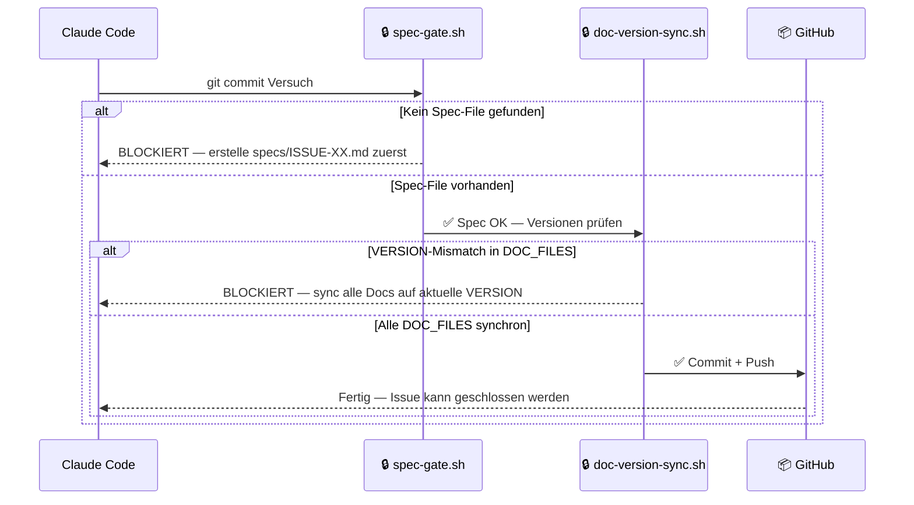

<a name="deutsch"></a>

# Bootstrap Skill

> Ein **portabler Bootstrap-Skill** fuer Claude Code, Codex oder Cross-Tool-Setups, der ein vollstaendiges KI-gesteuertes Entwicklungs-Governance-Framework fuer jedes neue Projekt einrichtet — in 4 Interview-Bloecken (A-D) plus 7 Setup-Phasen, ohne externe Abhaengigkeiten.

**Version 3.0 (April 2026)** — generisch, interview-freundlich, mit portablem Learning-Loop (L1/L2/L3). Kein Projekt-Typ-Lock-in, keine trading-spezifischen Altlasten mehr.
**Grundlage:** Claude Code Best Practice Checkliste v10 (OWLIST GmbH, 2026) — Context Engineering, Global Settings, Kontextschutz und Agent-Patterns sind als integraler Bestandteil in den Bootstrap-Prozess eingeflossen.

---

## Big Picture


*Vier Interview-Blöcke (A–D) umrahmen die Entscheidungen, vier Setup-Phasen (0, 4, 5, 7) setzen sie um. Block D aktiviert optionale Komponenten nur auf Wunsch. Ein eigener Learning-Loop-Kreislauf (`/sprint-review` → `journal/learnings.md` → `/ideation`) macht das Framework mit jedem Sprint klüger. [Excalidraw-Quelldatei](docs/bootstrap-big-picture.excalidraw)*

---

## Warum dieses Framework?

Die meisten AI-Development-Frameworks sind entweder zu viel Automation (Black Box, kein Traceability) oder zu wenig Struktur (Cursor-Rules ohne Governance). Dieses Framework trifft den Sweet Spot:

| Stärke | Was das bedeutet |
|--------|-----------------|
| 🔒 **Governance-Enforcement durch Git Hooks** | `spec-gate.sh` blockiert jeden Commit ohne Spec-File. `doc-version-sync.sh` blockiert jeden Push bei Versions-Drift. Kein anderes AI-Framework erzwingt das maschinell. |
| 🔗 **Vollständige Traceability** | Jede Änderung folgt dem Pfad: Idee → Backlog-Record/Adapter → Spec → Commit → Changelog. Lückenlos nachvollziehbar, auch Monate später. |
| 🔄 **Self-Healing als Safety-Net** | Ein Cron-Agent prüft alle 15 Minuten: Versionen synchron? Dateien vorhanden? Daemons laufen? Und korrigiert automatisch — ohne menschliche Intervention. |
| 👤 **Human-in-the-Loop konsequent erzwungen** | Kein Code-Change ohne Operator-Freigabe. Kein Issue ohne Spec. Kein Spec ohne Architekturdimensionen. Claude fragt — du entscheidest. |

> **Vergleich:** CrewAI hat Role-based Crews. AutoGen hat Debate-Pattern. Dieses Framework hat **erzwungene Governance** — das einzige Framework das maschinell sicherstellt, dass KI-generierter Code dieselben Qualitätsstandards erfüllt wie menschlicher Code.

---

## Detaillierter Framework-Vergleich

### Code-Crash Framework vs. CrewAI vs. AutoGen vs. BMAD vs. Cursor Rules

> Tausende AI-Development-Frameworks existieren. Hier ist eine ehrliche Einordnung — was andere besser machen, was dieses Framework einzigartig macht, und wann du welches wählen solltest.

| Dimension | **Code-Crash Framework** | CrewAI | AutoGen / AG2 | BMAD | Cursor Rules |
|-----------|------------------------|--------|---------------|------|--------------|
| **Governance-Enforcement** | ✅ Maschinell erzwungen (Git Hooks) | ❌ Keine | ❌ Keine | ⚠️ Manuell | ❌ Keine |
| **Traceability** | ✅ Idee → Issue → Spec → Commit | ❌ | ❌ | ⚠️ Partiell | ❌ |
| **Human-in-the-Loop** | ✅ Erzwungen (Spec-Freigabe) | ⚠️ Optional | ⚠️ Optional | ✅ Explizit | ❌ |
| **Self-Healing** | ✅ Cron, 15 Min, auto-korrigiert | ❌ | ❌ | ❌ | ❌ |
| **Learning-Loop** | ✅ Outcome-Check + LEARNINGS.md | ❌ | ❌ | ❌ | ❌ |
| **Modell-Routing** | ✅ Opus/Sonnet/Haiku je Task-Typ | ⚠️ Konfigurierbar | ✅ Gut | ❌ | ❌ |
| **Multi-Agent Orchestrierung** | ✅ Agent-Teams + Parallel-Subagents | ✅ Stark | ✅ Sehr stark | ⚠️ Manuell | ❌ |
| **Deploy-Automation** | ⚠️ Teilweise (Git Push + Manual) | ❌ | ❌ | ❌ | ❌ |
| **Portabilität** | ✅ Zero Dependencies, 1 Ordner | ⚠️ pip install | ⚠️ pip install | ⚠️ Prompt-Files | ✅ |
| **Projekt-Setup-Zeit** | ~30 Min (geführt) | Stunden | Stunden | ~1h | Minuten |
| **Zielgruppe** | Solo-Dev bis kleines Team | Enterprise-Teams | Forschung / Quality | Agile Teams | Einzelentwickler |

### Was andere Frameworks besser machen

| Framework | Echte Stärke | Wann bevorzugen |
|-----------|-------------|-----------------|
| **CrewAI** | Skalierbare Role-based Crews für Enterprise — 60% der Fortune 500 nutzen es. Beste Wahl wenn >10 Agents koordiniert werden müssen. | Großes Team, viele parallele Workflows, Enterprise-Compliance-Anforderungen |
| **AutoGen / AG2** | Debate-Pattern: 2 Agents argumentieren gegeneinander bis zur besten Lösung. Höchste Ausgabequalität für komplexe Analyse-Aufgaben. | Forschung, Code-Review mit höchsten Qualitätsanforderungen, offline Batch-Prozesse |
| **BMAD** | Strukturierter Agile-Workflow mit klaren Rollen (PM, Architect, Developer). Gut dokumentiert, große Community. | Teams die Scrum/Agile bereits kennen und einen AI-nativen Workflow wollen |
| **Cursor Rules** | Sofort einsatzbereit, keine Setup-Zeit, direkt im Editor. | Einzelentwickler die schnell starten wollen ohne Governance-Overhead |

### Was das Code-Crash Framework einzigartig macht

**1. Governance ist maschinell erzwungen — nicht nur dokumentiert**

Andere Frameworks haben READMEs mit Best Practices. Dieses Framework hat Git Hooks die physisch blockieren:
```
git commit → spec-gate.sh → BLOCKED wenn kein specs/ISSUE-XX.md existiert
git push   → doc-version-sync.sh → BLOCKED wenn Doku-Dateien veraltet sind
```
Kein anderes Framework in diesem Vergleich hat das.

**2. Vollständige Traceability ohne manuellen Aufwand**

Jede Änderung hinterlässt automatisch eine vollständige Spur:
```
💡 Idee → /ideation → 📋 Backlog-Record/Adapter (4 Perspektiven + ACs)
→ specs/ISSUE-XX.md (Operator-Freigabe) → git commit "T1: ..."
→ CHANGELOG.md (auto) → Obsidian Vault (auto-sync) → Issue Done
```
6 Monate später weißt du exakt warum jede Codezeile existiert.

**3. Learning-Loop: Framework wird mit jeder Story klüger**

Beim Setup: Primärmetrik + Baseline + Ziel definieren (z.B. "WinRate 33% → 45%").
Nach jedem Issue-Close: Outcome-Check-Datum gesetzt, Ergebnis in `journal/LEARNINGS.md`.
Claude weiß nach 10 Stories: "Stories mit Typ X verbessern die Metrik, Typ Y nicht."
Kein anderes Framework tracked Business-Outcomes systematisch.

**4. Self-Healing ohne Ops-Team**

Ein Cron-Agent läuft alle 15 Minuten und korrigiert automatisch:
- Versions-Drift zwischen Doku-Dateien → auto-sync
- Gestoppte Daemons → auto-restart mit Backoff
- Telegram-Alert bei Anomalien

Solo-Entwickler oder kleines Team ohne dediziertes Ops kann damit zuverlässig produzieren.

**5. Portabel — ein Ordner, null Dependencies**

```bash
cp -r bootstrap/ ~/.claude/skills/bootstrap/
# Fertig. Keine pip install, keine npm, keine Cloud-Abhängigkeiten.
```
Läuft auf Mac, VPS, Claude Code Desktop — überall gleich.

### Wann das Code-Crash Framework wählen

✅ **Ideal wenn:**
- Solo-Entwickler oder Team bis ~5 Personen
- Langlebiges Projekt (>3 Monate) das wartbar bleiben muss
- Produktion mit echten Business-Metriken (WinRate, Conversion, Latenz)
- Compliance oder Audit-Anforderungen (vollständige Traceability benötigt)
- Claude Code, Codex oder ein Cross-Tool-Setup als primaeres AI-Tool

⚠️ **Nicht ideal wenn:**
- Kurzes Experiment oder Proof-of-Concept (<2 Wochen)
- Großes Team (>10) mit eigener CI/CD-Pipeline (→ CrewAI oder AutoGen besser)
- Maximale Ausgabequalität wichtiger als Governance (→ AutoGen Debate-Pattern)
- Gar keine Backlog-/Spec-Disziplin gewuenscht ist (ein externer Tracker ist optional, der neutrale Backlog-Record nicht)

---

## Was dieser Skill macht

Wenn du `/bootstrap` in Claude Code eingibst, führt er dich durch die Einrichtung von:

| Was | Warum |
|-----|-------|
| **GOVERNANCE.md** | Blueprint für den KI-gesteuerten Entwicklungslebenszyklus — Regeln, Workflows, Qualitätsgates |
| **AGENTS.md / CLAUDE.md** | Runtime-Einstiege: Codex ueber AGENTS.md, Claude Code ueber CLAUDE.md, beide gebunden durch CONVENTIONS.md |
| **CONVENTIONS.md** | Adapter-Vertrag fuer Runtime, Backlog-Adapter, Governance-Modus, Execution-Isolation und Gates |
| **Self-Healing Agent** | Überwacht Dokumentversionen + Daemon-Gesundheit alle 15 Min (Cron) |
| **Doc-Sync-Modul** | Hält alle Docs auf derselben Version, optional gespiegelt nach Obsidian |
| **Issue-Schreibrichtlinien** | Strukturiertes Story-Format für KI + Mensch-Kollaboration |
| **Skills-Installation** | Verknüpft ideation, implement, backlog, architecture-review und mehr |
| **Backlog-Adapter + GitHub + Obsidian** | Verbindet Linear, GitHub Issues, Jira, Azure DevOps, Planner oder `none` zu einem kohaerenten Lebenszyklus |

---

## Industriestandard 7-stufiger Entwicklungsprozess

Dieses Framework orientiert sich an den bewährten Entwicklungspraktiken führender Tech-Unternehmen wie **Google, Amazon und Meta** und bildet deren **7-stufigen Software Development Lifecycle (SDLC)** vollständig mit KI-unterstützten Skills ab.

> **Kernprinzip:** Jede Entwicklungsphase — von der Idee bis zur Ueberwachung — wird durch einen dedizierten Skill unterstuetzt. Claude Code oder Codex kann der Operator sein; `CONVENTIONS.md` haelt die Runtime- und Adapter-Regeln zusammen.

| # | Phase | Google/Amazon-Standard | Unser Äquivalent | Skill(s) | Status |
|---|-------|------------------------|------------------|----------|--------|
| 1 | **Anforderungen** | PRD, User Stories, Stakeholder Input | `/ideation` → Backlog-Record/Adapter (4 Perspektiven, ACs, Abhängigkeiten) | `/ideation` | ✅ Abgedeckt |
| 2 | **Design** | Design Doc, Architecture Review, ADRs | `/ideation` (8 Dimensionen) + Architecture Design Doc im Issue + `/architecture-review` | `/ideation`, `/architecture-review` | ✅ Abgedeckt |
| 3 | **Planung** | Task Breakdown, Sprint Planning, Spec | `/implement` Schritt 4 → `specs/ISSUE-XX.md` (neu!) + `/backlog` für Priorisierung | `/implement`, `/backlog` | ✅ Abgedeckt |
| 4 | **Build** | Code, Tests, CI Pipeline | `/implement` Schritte 5–6 → Tasks aus Spec (T1→Verify→Commit→T2...) | `/implement` | ✅ Abgedeckt |
| 5 | **Review** | Code Review, QA, Security Review | `/implement` Schritt 7 → Post-Implement Validation (AC, Architektur-Quick-Check, Smoke Test, Security-Findings) | `/implement` | ✅ Abgedeckt |
| 6 | **Deploy** | CI/CD, Staging, Rollout | Git Push → Handoff → System liest CLAUDE.md. Daemon-Prozesse per Start-Scripts neugestartet | — | ⚠️ Teilweise |
| 7 | **Monitor** | Observability, Alerting, Incident Response | Self-Healing (Cron, 15 Min), Telegram-Alerts, `/breakfix`, `/status`, Morning Briefing | `/breakfix`, `/status` | ✅ Abgedeckt |

> **Fazit: 6 von 7 Phasen** sind vollständig durch Skills abgedeckt. **Deploy (Phase 6)** ist projektspezifisch und wird nicht automatisiert — hier gibt es eine separate [Monitoring-Empfehlung](#monitoring-empfehlung-außerhalb-bootstrap) mit Prometheus + Grafana.



---

## Die Kernidee

```
Idee → /ideation → Backlog-Record/Adapter → /backlog → /implement → Code + Docs → Git Push → Fertig
```

Jede Änderung ist:
1. **Autorisiert** durch einen Backlog-Record oder Adapter-Eintrag (kein Code ohne nachvollziehbare Story)
2. **Dokumentiert** im selben Commit (kein Code ohne Doku-Update)
3. **Überwacht** durch den Self-Healing Agent (Versions-Drift in 15 Min erkannt)
4. **Reproduzierbar**, weil jeder Workflow ein Skill ist



---

## Installation

### Auf einem bestehenden Claude Code System (gleicher Server)

```bash
# Bootstrap Skill in das Claude Code Skills-Verzeichnis kopieren
cp -r bootstrap/ ~/.claude/skills/bootstrap/

# Claude Code in einem beliebigen Verzeichnis starten und eingeben:
# /bootstrap
```

### Auf einem neuen Server (portabler Modus)

```bash
# 1. Claude Code installieren
# 2. Diesen Ordner in das Skills-Verzeichnis kopieren
mkdir -p /root/.claude/skills/
cp -r bootstrap/ ~/.claude/skills/bootstrap/

# 3. Claude Code öffnen
claude

# 4. Eingeben: /bootstrap
```

Keine Abhängigkeiten auf andere Dateien. Alle Templates sind in `references/` eingebettet.

---

## Was du vorher brauchst

### Bereithalten — was Bootstrap dich im Interview fragt

**Block A (Projekt-Kern, 9 Fragen):**
- Stack (Node.js / Frontend / Full-Stack / Python / Anderes)
- Projektname + Ein-Satz-Beschreibung
- Absoluter Pfad zum Projektverzeichnis
- Ziel-Runtime (`claude-code` / `codex` / `cross-tool` / `unknown`)
- Backlog-Adapter (`linear` / `github-issues` / `jira` / `azure-devops` / `planner` / `none`) + Issue-Praefix (z.B. `PROJ-`)
- Startversion (z.B. `1.0.0`)
- Architektur-Add-ons: Privacy / Cost / Signal / Compliance (beliebige Kombination, auch keine)

**Block B (Bestehende Infrastruktur, 6 Fragen):**
- GitHub-Repo vorhanden? (URL oder "neu anlegen")
- Projekt-Dokumentations-SSoT: Obsidian Vault, Repo `docs/project/`, externes DMS oder vorlaeufiger Repo-Fallback
- Backlog-Tool schon konfiguriert?
- `.env` schon da?
- `CLAUDE.md` schon da? (mergen oder überschreiben)
- Developer Onboarding erzeugen oder vorhandenes Onboarding verlinken

**Block C (Doku-Architektur):** Bootstrap schlägt Project Hub, Developer Onboarding, Governance, Zielarchitektur, Backlog-Verweis und die 3-Schichten-Doku vor — du bestätigst oder passt an. Obsidian ist Best Practice, aber keine Voraussetzung.

**Block D (Optional-Komponenten, am Ende):** Self-Healing, DocSync, Automation-Daemon, Learning-Loop L1/L2/L3, SonarQube, Research, Visualize/Miro und Monitoring-Postflight.

**Optionale API-Keys (kannst du auch später nachtragen):**
- Telegram Bot Token (für Self-Healing Alerts)
- OpenRouter/Perplexity API Key (für `/research` Deep-Tier)
- Grafana Cloud URL + API Key (für Monitoring-Dashboards)

**Provider-Postflight:** Bootstrap bewertet externe Provider separat vom Skill-Installationsstatus. GitHub, Backlog-Adapter, Research, Visualize/Miro, Monitoring und Obsidian bekommen `OK`, `WARN`, `SKIP` oder `FAIL`; Secrets werden dabei nie angezeigt oder in Dateien geschrieben. Details: `references/provider-postflight.md`.

---

## Dateistruktur

```
bootstrap/
├── SKILL.md                                    ← Skill-Definition (Claude liest dies)
├── README.md                                   ← Diese Datei
├── GAPS.md                                     ← Gap-Analyse: was fehlt noch (internes Audit)
├── docs/
│   └── diagrams/                               ← Visuelle Diagramme (Excalidraw + PNG-Exports)
│       ├── 00-big-picture.excalidraw
│       ├── 01-anforderungen.excalidraw … 07-monitor.excalidraw
│       └── *.png                               ← Exportierte PNG-Versionen
└── references/                                 ← Alle Templates eingebettet — keine externen Deps
    │
    ├── PROJEKT-SETUP
    ├── info-gathering.md                       ← Checkliste der zu sammelnden Infos (inkl. MCP, Telegram, Grafana)
    ├── file-templates.md                       ← config.js, CLAUDE.md, .env.example, .gitignore, .claudeignore etc.
    ├── governance-template.md                  ← Vollständige GOVERNANCE.md (portabel, eingebettet)
    ├── architecture-design-template.md         ← ARCHITECTURE_DESIGN.md Starter
    │
    ├── GOVERNANCE & HOOKS
    ├── hooks-setup.md                          ← spec-gate.sh + doc-version-sync.sh Templates
    ├── issue-writing-guidelines-template.md    ← Issue-Format-Richtlinien für KI + Mensch
    │
    ├── INFRASTRUKTUR & SERVICES
    ├── mcp-setup.md                            ← MCP-Server einrichten (Linear, Grafana, Supabase, Hostinger …)
    ├── telegram-setup.md                       ← Telegram Bot + Chat-ID + Linear-Webhook vollständig
    ├── grafana-monitoring.md                   ← Grafana Cloud + Alloy + /grafana Skill Nutzungsmuster
    │
    ├── CODE-QUALITÄT & AGENTS
    ├── agent-patterns.md                       ← 4 Team-Patterns als .claude/rules/ Vorlage (Lazy Loading)
    │
    ├── RUNTIME
    ├── self-healing-template.js                ← Self-Healing Agent Starter-Code
    ├── doc-sync-template.js                    ← Doc-Sync-Modul Starter-Code
    │
    ├── SKILLS
    ├── skills-setup.md                         ← Symlinks vs. Kopien, Reihenfolge, generierte Skills
    ├── breakfix-template.md                    ← /breakfix Skeleton (projekt-individuell generiert)
    ├── integration-test-template.md            ← /integration-test Skeleton
    ├── status-template.md                      ← /status Skeleton
    ├── wrap-up-template.md                     ← /wrap-up Skill (Session-Abschluss + Auto-Memory)
    │
    └── ABSCHLUSS
        └── global-registry-update.md          ← Wie Projekt in ~/.claude/CLAUDE.md registrieren
```

---

## Die Bootstrap-Phasen (v3.0)

Der Bootstrap ist in **4 Interview-Bloecken (A-D)** plus **Execution-Phasen (4-7)** strukturiert.

| Phase | Was passiert | Eingabe noetig? |
|-------|-------------|----------------|
| **Phase 0** — Briefing | Skill kuendigt den 4-Block-Flow an | Bestaetigung "bereit" |
| **Block A** — Projekt-Kern | Stack + Name + Runtime + Backlog-Adapter + Prefix + Version + Add-ons (Privacy, Cost, Signal, Compliance) | 9 Fragen |
| **Block B** — Bestehende Infrastruktur | GitHub/Obsidian/Backlog/Env — integriert in bestehenden Stand | 5 Fragen |
| **Block C** — Doku-Architektur | 3-Schichten-Vorschlag (Story-Specs, Component-Docs, Architektur-Vorgaben) + Hub-Auto-Verlinkung | Bestaetigung / Anpassung |
| **Phase 4** — Grundstruktur | Verzeichnisse, Git, Kerndateien, `.claudeignore`, Hooks, Component-Skelette | `.env`-Bestaetigung |
| **Phase 5** — Skills via git-clone | Skills aus `claudecodeskills` kopieren (keine VPS-Symlinks) | Skill-Tier |
| **Block D** — Optional-Komponenten | Self-Healing / DocSync / Automation-Daemon / Learning-Loop / SonarQube / Research / Visualize / Monitoring — alle am Ende | gezielte Fragen + Provider-Postflight |
| **Phase 7** — Registry + Finalisierung | Obsidian PMO-Hub + Projekt-Index + Final-Commit | Keine |



---

## Was erstellt wird

Nach `/bootstrap` hat dein Projekt und deine globale Umgebung:

### Global / Runtime (einmalig — gilt fuer alle Projekte)

```
~/.claude/                 ← Claude Code Runtime, falls aktiv
└── CLAUDE.md              ← Modell-Routing, Agent-Strategie, Secrets-Policy

~/.codex/                  ← Codex Runtime, falls aktiv
└── AGENTS.md              ← Codex-Regeln und Adapter-Hinweise
```

### Im Projekt

```
mein-projekt/
├── lib/
│   ├── config.js          ← VERSION + DOC_FILES — einzige Wahrheitsquelle
│   └── doc-sync.js        ← Synchronisiert alle Docs + Obsidian Vault
├── agents/
│   └── self-healing.js    ← Cron-Gesundheitsmonitor (alle 15 Min)
│
├── AGENTS.md              ← Codex-Einstieg, Repo-Regeln, Scope-Hinweise
├── CLAUDE.md              ← Claude-Code-Einstieg + Kompatibilitaetsbruecke
├── CONVENTIONS.md         ← Runtime-/Backlog-/Governance-Adapter-Vertrag
├── CLAUDE.local.md        ← Persönliche Overrides (gitignored)
├── ARCHITECTURE_DESIGN.md ← Einstiegsdokument für Architekturentscheidungen
├── SYSTEM_ARCHITECTURE.md ← Komponenten, Datenfluss, externe Abhängigkeiten
├── COMPONENT_INVENTORY.md ← Datei-Inventar (Self-Healing prüft dies)
├── GOVERNANCE.md          ← Vollständiges Governance-Blueprint
├── DEVELOPMENT_PROCESS.md ← Entwicklungsprozess für dieses Projekt
├── SECURITY.md            ← API Key-Policy, Bedrohungsmodell
├── CHANGELOG.md           ← Auto-aktualisiert durch doc-sync
├── API_INVENTORY.md       ← Alle externen APIs dokumentiert
├── INDEX.md               ← Docs-Index (Claude navigiert damit)
├── PROCESS_CATALOG.md     ← Alle Prozesse und Workflows
│
├── .env                   ← API Keys (gitignored)
├── .env.example           ← Format-Erklärungen für jeden Key (nie echte Keys!)
├── .gitignore             ← inkl. .env, CLAUDE.local.md, node_modules
├── .claudeignore          ← Kontextschutz: node_modules, .env, Logs (Claude liest diese nie)
│
├── specs/
│   └── TEMPLATE.md        ← Story-Template mit Agent-Pattern, DB-Impact, Rollback
├── journal/
│   ├── STRATEGY_LOG.md    ← Pflichtlektüre vor /ideation — verhindert Wiederholungen
│   └── LEARNINGS.md       ← Outcome-Tracking nach Issue-Close
│
├── .claude/ oder .codex/  ← je nach RUNTIME_TARGET, cross-tool nutzt beide
│   └── skills/
│       ├── ideation/
│       ├── implement/
│       └── backlog/
└── .claude/
    ├── settings.json      ← Projekt-Permissions + Hooks (spec-gate, guard, format, Stop)
    ├── ISSUE_WRITING_GUIDELINES.md
    ├── hooks/
    │   ├── spec-gate.sh           ← Blockiert Commit ohne Spec-File
    │   ├── doc-version-sync.sh    ← Blockiert Push bei Versions-Drift
    │   ├── guard.sh               ← Blockiert Zugriff auf .env + Schlüsseldateien
    │   └── format.sh              ← Auto-Format nach Edit/Write (Biome/Black)
    ├── rules/
    │   └── agent-patterns.md      ← 4 Team-Patterns, Lazy Loading (0 Token-Overhead)
    └── skills/
        ├── ideation/      ← lokale Kopie via git clone (v3.0)
        ├── implement/     → Symlink oder Kopie
        ├── backlog/       ← lokale Kopie via git clone (v3.0)
        └── ...            → je nach gewähltem Skill-Tier
```

---

## Die 8 unverbrüchlichen Regeln

Claude folgt diesen Regeln im gesamten Framework:

1. **Niemals ohne Backlog-Record oder Adapter-Story implementieren** — jede Aenderung muss nachverfolgbar sein
2. **Niemals ein Issue ohne Changelog schließen** — die Geschichte muss vollständig sein
3. **Niemals Code ändern ohne vorherige Rückfrage** — Mensch-in-der-Schleife für Risikokontrolle
4. **Niemals "fertig" behaupten ohne Git Push** — Code muss immer im Remote sein
5. **Niemals ein Operator-Briefing im Backlog-Adapter kuerzen** — Originaltext ist Wahrheit
6. **Niemals ein Issue ohne Labels anlegen** — Labels sind essenziell für die Filterung
7. **Niemals Sub-Tasks direkt nach Done verschieben** — immer durch "In Progress" zuerst
8. **Niemals eine API-Integration hinzufügen ohne das API-Inventar zu aktualisieren**



---

## Der Self-Healing-Mechanismus

```
Cron (alle 15 Min)
    └── node agents/self-healing.js
            ├── Check M: Alle DOC_FILES auf derselben VERSION wie config.js?
            │   → Nein: Alert + Auto-Sync via doc-sync.js
            ├── Check U: Alle dokumentierten Komponenten auf dem Dateisystem?
            │   → Nein: Warnung
            └── Check P: Alle Daemon-Prozesse laufen (Lock-Files)?
                → Nein: Neustart via Start-Script + Backoff
```

Die Versionsnummer in `config.js` ist die **einzige Wahrheitsquelle**. Wenn du sie erhöhst, aktualisiert Self-Healing automatisch alle Dok-Dateien beim nächsten Cron-Lauf.

---

## Alle Skills im Überblick

Dieser Bootstrap-Skill richtet dein Projekt für folgende Skills ein:

| Skill | Auslöser | Zweck | SDLC Phase |
|-------|---------|-------|------------|
| `/ideation` | "Ich habe eine Idee" | Recherche → Architektur-Design → Backlog-Record/Adapter | 1, 2 |
| `/implement` | "los", "starte ISSUE-XX" | 7-stufiger SDLC-Workflow mit Qualitätsgates | 3, 4, 5 |
| `/backlog` | "was steht an" | Sprint-Planung + Abhaengigkeitsanalyse ueber neutralen Backlog-Record und Adapter | 3 |
| `/architecture-review` | "Architektur prüfen" | 8-Dimensionen-Qualitätsbericht | 2 |
| `/sprint-review` | "Sprint Review" | Quartals-Audit + Tech Debt | 5 |
| `/research` | "recherchiere X" | 2-Tier: WebSearch + Perplexity Deep Research | 1, 2 |
| `/breakfix` | "System kaputt" | Incident Response: Detect → Fix → Document | 7 |
| `/status` | "Status" | System Status Dashboard | 7 |
| `/wrap-up` | "Exit", "Ende" | Session-Abschluss + Memory-Persistierung | 7 |

Alle Skills sind aus dem gleichen Code-Crash Framework und arbeiten zusammen.

---

## Monitoring-Empfehlung (außerhalb Bootstrap)

> ⚠️ **Wichtiger Hinweis:** Dieser Abschnitt beschreibt eine **Empfehlung** — keinen automatischen Bootstrap-Schritt. Der hier beschriebene Setup muss **manuell nach dem Bootstrap** eingerichtet werden und ist **nicht** Teil des Bootstrap-Prozesses.

Der Bootstrap-Prozess richtet ein einfaches Self-Healing-Monitoring ein (Check M, U, P — alle 15 Min). Für ein vollständiges **Produktions-Monitoring** empfehlen wir folgenden Stack — so wie wir es im CLAW Trading System produktiv einsetzen:

### Empfohlener Monitoring-Stack

| Komponente | Zweck | Kosten |
|-----------|-------|--------|
| **Prometheus** | Metriken sammeln + speichern (Time-Series-Datenbank) | Open Source — kostenlos |
| **Node Exporter** | Server-Metriken exportieren (CPU, RAM, Disk, Prozesse) | Open Source — kostenlos |
| **Grafana Cloud** | Dashboards + Alerting + Visualisierung | Free Tier verfügbar |

### Warum dieser Stack?

- **Prometheus** ist der Industriestandard für Metriken-Sammlung (verwendet von Google, Netflix, Spotify)
- **Grafana Cloud** ermöglicht professionelle Dashboards ohne eigene Infrastruktur
- Der **`/grafana` Skill** (Code-Crash Framework) erstellt und verwaltet Dashboards direkt via Grafana MCP Server — Claude baut die Dashboards für dich

### Kurzanleitung

```bash
# 1. Prometheus auf deinem Server installieren
# → Offizielle Doku: https://prometheus.io/docs/introduction/first_steps/

# 2. Node Exporter für Server-Metriken installieren
# → Offizielle Doku: https://prometheus.io/docs/guides/node-exporter/

# 3. Grafana Cloud Account anlegen (Free Tier reicht für den Einstieg)
# → https://grafana.com/products/cloud/

# 4. Prometheus als Data Source in Grafana konfigurieren
# → Grafana UI: Connections → Data Sources → Prometheus → URL eingeben

# 5. Optional: /grafana Skill in Claude Code installieren
# → Erstellt und verwaltet Dashboards direkt via Grafana MCP Server
cp -r /root/.claude/skills/grafana/ .claude/skills/grafana/
```

### Was du damit überwachst

- Laufende Daemon-Prozesse (via Node Exporter)
- API-Latenz und Fehlerrate (Custom Metriken)
- Versions-Drift-Warnungen (Self-Healing Alerts)
- Projekt-spezifische Business-Metriken

---

## Portabilität

Dieser Skill hat **keine externen Abhängigkeiten**:

| Gebraucht | Quelle |
|-----------|--------|
| GOVERNANCE.md Inhalt | `references/governance-template.md` (eingebettet) |
| Self-Healing Skript | `references/self-healing-template.js` (eingebettet) |
| Doc-Sync Skript | `references/doc-sync-template.js` (eingebettet) |
| Issue-Richtlinien | `references/issue-writing-guidelines-template.md` (eingebettet) |
| Datei-Templates | `references/file-templates.md` (eingebettet) |

### Runtime, Backlog und Governance-Modi

Bootstrap fragt explizit nach der Ziel-Runtime:

| Runtime | Einstieg | Rolle |
|---------|----------|-------|
| `claude-code` | `CLAUDE.md` | Claude Code ist primaer; `AGENTS.md` kann als Codex-Bruecke mitlaufen |
| `codex` | `AGENTS.md` | Codex ist primaer; `CLAUDE.md` bleibt Kompatibilitaetsbruecke |
| `cross-tool` | beide | beide Einstiege aktiv, `CONVENTIONS.md` ist der harte Vertrag |
| `unknown` | beide | portable Baseline, spaeter schaerfen |

Backlog ist adapter-neutral: Linear, GitHub Issues, Jira, Azure DevOps, Planner und `none` mappen auf denselben Backlog-Record. Linear ist unterstuetzt, aber keine Voraussetzung.

Governance-Modi (`lite`, `standard`, `heavy`) steuern die Strenge der Gates und Nachweise. Sie duerfen keine Basis-Artefakte oder Skills entfernen: Runtime-Einstieg, `CONVENTIONS.md`, Hub-Doku, Spec-Template, `journal/`, Backlog-Record und Skill-Baseline bleiben immer vorhanden.

Der Abschlussbericht nutzt `OK`, `WARN`, `SKIP`, `FAIL`. Externe Provider werden separat geprueft; lokale Dateien allein machen GitHub, Linear/Jira/Azure/Planner, SonarQube, Grafana, Telegram oder Obsidian-Sync nicht automatisch `OK`. Secrets duerfen nie in Chat, Repo, Logs oder Abschlussbericht landen. Bestehende Projekte folgen dem Upgrade-Pfad aus `references/framework-upgrade.md`: `inspect`, `apply-safe`, `apply-with-confirmation`, inklusive optionalem Report unter `journal/reports/framework-upgrade/YYYY-MM-DD.md`.

Den `bootstrap/` Ordner irgendwohin kopieren → es funktioniert sofort.

---

## Voraussetzungen

### Pflicht

| Was | Warum |
|-----|-------|
| **Claude Code** | claude.ai/claude-code — der KI-Operator |
| **Node.js** | für self-healing + doc-sync |
| **GitHub Repository** | bereits angelegt (leer oder mit Code) |
| **SSH-Zugang zu GitHub** | falls ein GitHub-Remote genutzt und gepusht werden soll — **siehe unten** |
| **Backlog-Entscheidung** | externer Adapter oder `none` fuer lokale Backlog-Records |

### SSH-Zugang zu GitHub einrichten

Bootstrap führt am Ende `git push` aus. Dafür muss SSH konfiguriert sein.

**Mac / lokaler PC:**
```bash
# 1. SSH Key generieren (falls noch keiner vorhanden)
ssh-keygen -t ed25519 -C "deine@email.com"
# → Key liegt in ~/.ssh/id_ed25519.pub

# 2. Public Key in GitHub hinterlegen
# GitHub → Settings → SSH and GPG Keys → New SSH Key
cat ~/.ssh/id_ed25519.pub  # diesen Text in GitHub einfügen

# 3. Testen
ssh -T git@github.com
# Erwartet: "Hi username! You've successfully authenticated..."
```

**VPS / Server (z.B. Hostinger):**
```bash
# Gleicher Prozess — auf dem Server ausführen
ssh-keygen -t ed25519 -C "vps@meinprojekt.com"
cat ~/.ssh/id_ed25519.pub
# → In GitHub unter Settings → SSH Keys hinterlegen
ssh -T git@github.com  # Test
```

**Claude Code Desktop (Mac App):**
```bash
# Claude Code nutzt den SSH-Agenten des Systems
# Wenn ssh -T git@github.com funktioniert → Claude Code kann pushen
# Falls nicht: ssh-add ~/.ssh/id_ed25519
```

> **Hinweis:** Bootstrap prüft SSH in Phase 0 automatisch mit `ssh -T git@github.com`.
> Wenn der Test fehlschlägt, hält Bootstrap an und zeigt die Einrichtungsanleitung.

### Optional

| Was | Wofür |
|-----|-------|
| **Obsidian** | Doc-Sync in Vault |
| **Telegram Bot** | Self-Healing Alerts |
| **OpenRouter API Key** | `/research` Deep-Tier via Perplexity |
| **Hostinger API Key** | `/cloud-system-engineer` Skill |
| **Miro Access Token** | `/visualize` Skill |
| **notebooklm-py** CLI | `/notebooklm` Skill |
| **Grafana Cloud Account** | Monitoring-Dashboards (Empfehlung — siehe oben) |
| **Prometheus** | Metriken-Sammlung (Empfehlung — siehe oben) |

---

## Lizenz

MIT — frei verwendbar, adaptierbar für dein Projekt.

Teil des **Code-Crash Frameworks**.
